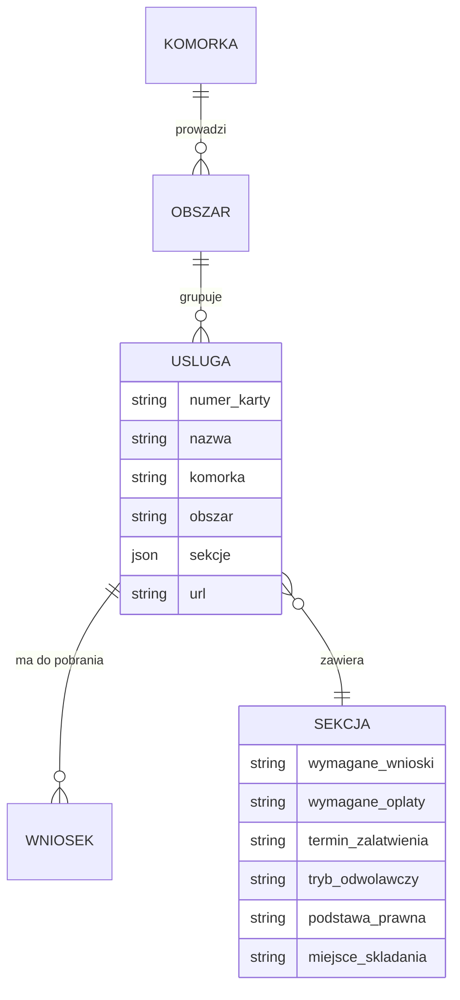
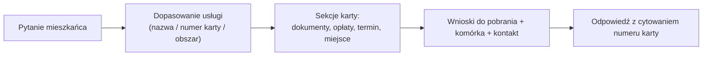

# BIP Lublin — baza wiedzy dla asystenta AI

> Zbudowane z lokalnych plików `bip_pages/*.json` przez `build_db.py` (bez ponownego pobierania). Źródło: bip.lublin.eu/e-urzad/opisy-uslug.

## 1. Co mamy

| Encja | Liczba |
| --- | --- |
| Unikalne usługi (karty informacyjne) | 389 |
| …w tym z pełnym opisem (≥3 sekcje) | 380 |
| Komórki załatwiające sprawy | 26 |
| Wnioski/formularze do pobrania | 1117 |
| Strony listujące (taksonomia) | 96 |
| Strony kontekstowe (władze/struktura) | 5 |

## 2. Model danych (schemat)

## 3. Ścieżka odpowiedzi asystenta

## 4. Usługi wg komórki organizacyjnej

| Komórka | Usług | Obszary |
| --- | --- | --- |
| Wydział Spraw Administracyjnych | 59 | Alkohol zezwolenia, Dowod osobisty, Ewidencja dzialalnosci gospodarczej, Pesel, Rejestr wy |
| Wydział Komunikacji | 53 | Komunikacjatransport, Prawo jazdyuprawnienia do kierowania pojazdami, Rejestracja i oznacz |
| Wydział Geodezji | 30 | Ewidencja gruntow i budynkow, Grunty, Inwestycje, Mapy wypisy i wyrysy z operatu ewidencyj |
| Wydział Spraw Mieszkaniowych | 28 | Eksmisje, Lokale mieszkalne socjalne i zakladowe, Najem, Remonty i adaptacje, Repatriacja, |
| Wydział Podatków | 23 | Interpretacja przepisow, Nadplaty i zwroty podatkow i oplat, Podatek lesny, Podatek od nie |
| Urząd Stanu Cywilnego | 21 | Akty stanu cywilnego, Dziecko, Imie i nazwisko, Malzenstwo, Zgon |
| Wydział Gospodarowania Mieniem i Energią | 18 | Dzierzawy, Lokale mieszkalne sprzedaz, Sluzebnosci, Spadki gminy lublin, Sprzedazwykup, Uz |
| Wydział Zieleni i Gospodarki Komunalnej | 17 | Cmentarze i groby, Decyzje srodowiskowe, Ochrona zwierzat, Retencja terenowa, Warunki na p |
| Wydział Architektury i Budownictwa | 16 | — |
| Biuro Miejskiego Konserwatora Zabytków i Rewitalizacji | 13 | — |
| Wydział Ochrony Środowiska | 13 | Gospodarka wodna, Ochrona powietrza, Odpady komunalne, Odpady przemyslowe, Pozostale wos |
| Wydział Sportu i Turystyki | 13 | Ewidencja sportowa, Ewidencja turystyczna |
| Wydział Planowania | 12 | — |
| Wydział Egzekucji | 9 | Postepowanie egzekucyjne |
| Wydział Kultury | 9 | — |
| Wydział Świadczeń | 9 | — |
| Kancelaria Prezydenta | 7 | — |
| Miejski Zespół do Spraw Orzekania o Niepełnosprawności | 7 | — |
| Wydział Zarządzania Ruchem Drogowym i Mobilnością | 6 | — |
| Biuro Rady Miasta | 5 | — |
| Wydział Organizacji Urzędu | 5 | — |
| Wydział Oświaty i Wychowania | 5 | — |
| Wydział Zdrowia i Profilaktyki | 4 | Wpis do rejestru zlobkow i klubow dzieciecych |
| Wydział Bezpieczeństwa Mieszkańców i Zarządzania Kryzysowego | 3 | — |
| Wydział Inicjatyw i Programów Społecznych | 3 | Karta duzej rodziny, Lubelska karta seniora, Rodzina trzy plus |
| Wydział Budżetu i Księgowości | 1 | — |

## 5. Przykład pełnej karty usługi (jak wygląda rekord)

**Pozwolenie na podejmowanie innych działań, które mogłyby prowadzić do naruszenia substancji lub zmiany wyglądu zabytku wpisanego do rejestru zabytków** · karta `MKZ-006` · Biuro Miejskiego Konserwatora Zabytków i Rewitalizacji

- **Wymagane wnioski:** MKZ-006-01 - wniosek o wydanie pozwolenia na podejmowanie innych działań, które mogłyby prowadzić do naruszenia substancji lub zmiany wyglądu zabytku.
- **Wymagane załączniki:** program podejmowania innych działań, zawierający imię i nazwisko autora oraz informacje niezbędne do oceny wpływu innych działań na zabytek, dokument potwierdzający posiadanie przez wnioskodawcę tytuł
- **Sposób i miejsce składania dokumentów:** Elektronicznie, na adres do doręczeń elektronicznych Urzędu Miasta Lublin: AE:PL-40073-96065-RTJAF-25 z wykorzystaniem opcji "Napisz wiadomość" oraz opatrzenia wiadomości podpisem elektronicznym.
Szcz
- **Wymagane opłaty:** Opłata skarbowa za wydanie pozwolenia na podejmowanie innych działań, które mogłyby prowadzić do naruszenia substancji lub zmiany wyglądu zabytku wpisanego do rejestru zabytków wynosi 82 zł. Opłata sk
- **Sposób i miejsce odbioru dokumentów:** Elektronicznie, na adres doręczeń elektronicznych, jeśli wnioskodawca taki adres posiada.
W siedzibie organu:
Biuro Miejskiego Konserwatora Zabytków i Rewitalizacji
ul. Spokojna 2, sekretariat pokój n
- **Termin załatwienia sprawy:** bez zbędnej zwłoki, w ciągu miesiąca od wszczęcia postępowania, gdy sprawa wymaga postępowania wyjaśniającego, w ciągu dwóch miesięcy od wszczęcia postępowania, w sprawie szczególnie skomplikowanej.
- **Tryb odwoławczy:** Od decyzji przysługuje, w terminie 14 dni od daty doręczenia decyzji, odwołanie do Ministra Kultury i Dziedzictwa Narodowego za pośrednictwem Prezydenta Miasta Lublin. Odwołania proszę kierować na adr
- **Informacje dodatkowe:** W razie stwierdzenia braków formalnych wniosku, urząd wezwie wnioskodawcę w trybie art. 64 § 2 ustawy z dnia 14 czerwca 1960 r. Kodeks postępowania administracyjnego (tekst jednolity - Dz. U. z 2025 r
- **Podstawa prawna:** Ustawa z dnia 23 lipca 2003 r. o ochronie zabytków i opiece nad zabytkami (tekst jednolity - Dz. U. z 2024 r. poz. 1292), Rozporządzenie Ministra Kultury i Dziedzictwa Narodowego z dnia 2 sierpnia 201

## 6. Jak użyć w asystencie (RAG)

1. `bip_db/services.json` — rdzeń bazy: lista unikalnych usług z sekcjami i wnioskami.
2. `bip_db/services.jsonl` — gotowe fragmenty do embeddingu (1 usługa = 1 chunk) → baza wektorowa (Chroma/FAISS/Qdrant).
3. `bip_db/services.csv` — szybkie przeszukiwanie/filtrowanie w arkuszu.
4. `bip_db/database.json` — całość (usługi + mapa komórek/obszarów).
5. Lokalny model (Bielik/Llama/Mistral) + retrieval po `services.jsonl` → odpowiedź po polsku z numerem karty i nazwą komórki.
